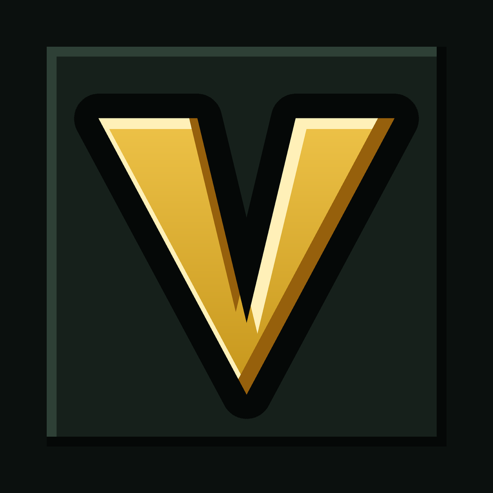
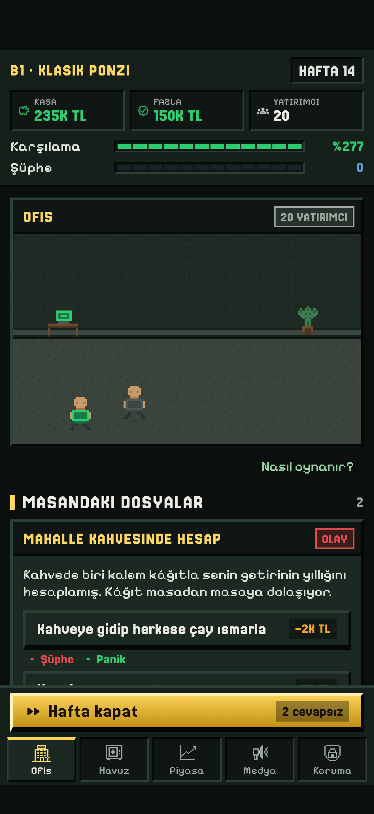
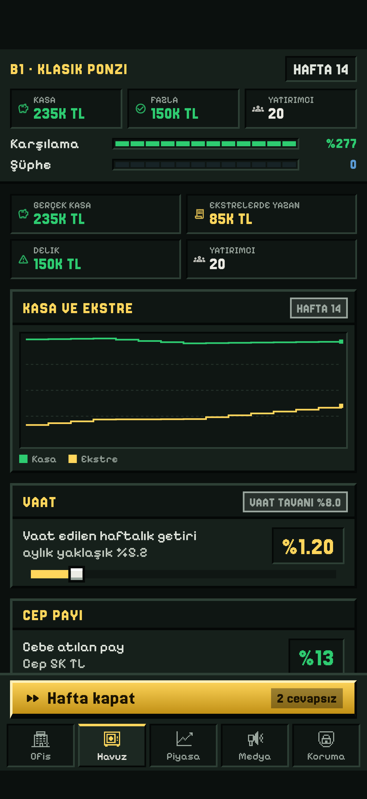
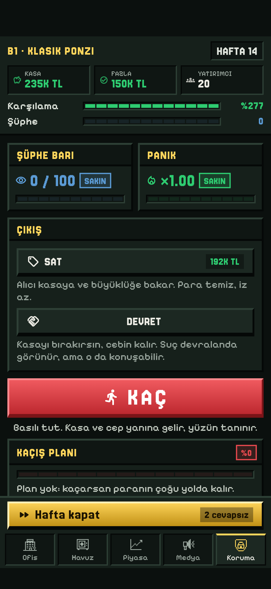
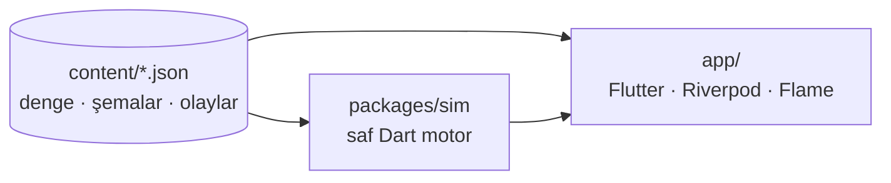

<p align="center">
  
</p>

<h1 align="center">Vaat: Dolandırıcı Kariyeri</h1>

<p align="center">
  Hicivli, tur bazlı, pixel art bir dolandırıcı kariyeri simülasyonu.<br>
  <strong>Kazanmak yok, sadece daha iyi kaçmak var.</strong>
</p>

<p align="center">
  
  
  
  
</p>

<p align="center">
  <a href="docs/index.html">Web sayfası</a> ·
  <a href="docs/gizlilik.html">Gizlilik</a> ·
  <a href="docs/destek.html">Destek</a> ·
  <a href="docs/app-store.md">Mağaza metinleri</a>
</p>

---

## Oyun

Bir dolandırıcı kariyeri yaşarsınız. Her bölümde farklı türde bir şema kurar, yatırımcı toplar, ödemeleri yeni gelen parayla yaparsınız. Bölüm ancak dört şekilde biter: **kaçarsınız**, firmayı **satarsınız**, birine **devredersiniz** ya da **yakalanırsınız**. Kaçan para, tanıdıklar ve "geçmiş dosyası" bir sonraki bölüme taşınır; kariyer kendi sonunu kendi getirir.

Her olay kartı gerçek bir vakadan türetildi, isimler ve markalar değiştirildi. Hiciv dolandırıcıya ve sisteme yöneliktir, mağdura değil.

<p align="center">
  
  
  
</p>

### Öne çıkanlar

| | |
|---|---|
| **7 şema türü** | Klasik Ponzi, Yatırım Grubu, Kripto Borsası, Saadet Zinciri, Üretim Kılıfı, Faizsiz Holding, Aracı Kurum. Her birinin ritmi ve ölüm şekli farklı. |
| **234 olay kartı** | Şemaya, piyasaya, işletmelerinize ve önceki kararlarınıza bağlı. Zincirli kartlar: reklam yüzüyle anlaştıysanız skandal birkaç hafta sonra gelir. |
| **Kariyer katmanı** | Bölümler arasında işletme alın, tanıdık edinin, kaçış planı kurun, ortak seçin, kara parayı aklayın. |
| **7 kariyer sonu** | Güney Amerika çiftliğinden hapse. Her sonun skor çarpanı farklı; yakalanmak sıfır yazar. |
| **Deterministik sim** | Aynı seed, aynı hamleler, aynı sonuç. Denge terminalde botlarla ölçülür. |
| **Veri toplamaz** | Sunucu yok, hesap yok, ağ isteği yok. Kayıt telefonda kalır. |

> Bu oyun hicivdir, yatırım tavsiyesi değildir. Gerçek hayatta yüksek ve düzenli getiri vaadi görürseniz düzenleyici kuruma sorun.

## Mimari



| Klasör | Ne var |
|---|---|
| `packages/sim/` | Simülasyon motoru. Flutter bağımlılığı yok. `tick()` tek giriş noktası, seed'li RNG. Denge botları `bin/run.dart` içinde. |
| `content/` | Tek doğruluk kaynağı: `balance.json`, `schemes.json`, işletmeler, tanıdıklar, kaçış planı ve `events/*.json`. Uygulama bunu sembolik bağla okur. |
| `app/` | Flutter uygulaması. 5 sekme, HUD, tycoon parça takımı (`lib/ui/pixel.dart`), Flame ofis sahnesi, JSON kayıt. |
| `tools/` | Üretici scriptler: ikon, sprite'lar, sekme ikonları, ekran görüntüsü düzleştirme. Görseller elle çizilmiş dosya değil, koddan üretilir. |
| `docs/` | Gizlilik ve destek sayfaları, mağaza metinleri. GitHub Pages ile yayımlanır. |
| `screenshots/` | App Store görüntüleri, üç cihaz boyutu. |

## Hızlı başlangıç

**Simülasyonu terminalde koşturun**

```bash
cd packages/sim
dart pub get
dart test
dart run bin/run.dart sim --weeks 260 --rate 0.012 --skim 0.13 --seed 42
dart run bin/run.dart strategy --seeds 20
```

`sim` bir şemayı hafta hafta koşturur ve çöküş anını yazar. `strategy` dört botu (pasif, açgözlü, temkinli, borsacı) her şemada oynatır; denge değişince ilk bakılan tablo budur. `verify` ve `sweep` komutları da var.

**Uygulamayı çalıştırın**

```bash
cd app
flutter pub get
flutter test
flutter run
```

Hedef yalnız iPhone. Web derlemesi geliştirme önizlemesi için duruyor.

## İçerik yazmak

Olay kartları JSON; kod derlemesi gerekmez. Bir kartın iskeleti:

```json
{
  "id": "chain_celebrity_scandal",
  "title": "Reklam yüzü karakolda",
  "text": "Reklam yüzün bir gece kulübünde kavgaya karışmış...",
  "weight": 1.2,
  "conditions": { "after": { "event": "celebrity_endorsement_offer", "options": [0], "minWeeks": 4 } },
  "options": [
    { "label": "Sözleşmeyi feshet", "effects": { "cash": -30000, "suspicion": -3 } },
    { "label": "Sessiz kal", "effects": { "suspicion": 7, "panic": 0.1 } }
  ]
}
```

**Kurallar**

- Son seçenek her zaman pasif olandır: cevapsız bırakılan kart hafta kapanırken son seçenekle kapanır.
- Gerçek kişi, marka ve kurum adı yok. Kime gülüyoruz sorusu her metinde: dolandırıcıya ve sisteme.
- Olay sıklığı sabittir (`baseChancePerWeek`). Kart eklemek çeşitliliği artırır, sıklığı değil; yumuşak kart eklerseniz sert kartları seyreltirsiniz, `strategy` ile kontrol edin.

**Koşullar** (`conditions`): `minWeek`, `maxWeek`, `minSuspicion`, `maxSuspicion`, `minPanic`, `minInvestors`, `maxCoverage`, `schemes`, `regimes` ve:

| Anahtar | Anlamı |
|---|---|
| `owns` | Sayılan işletme veya tanıdıklardan en az biri varsa gelir. Id'ler `businesses.json` ve `contacts.json` içinde. |
| `partner` | `true` yalnız ortağı olana, `false` yalnız ortaksız oynayana. |
| `after` | Zincir. `{"event", "options", "minWeeks"}`: öncül kartta o seçenek seçildiyse ve süre geçtiyse gelir. |

**Etkiler** (`effects`): `cash`, `suspicion`, `panic`, `promisedRateDelta`, `skimDelta`, `fixedCostDelta`, `channelMult` + `channelMultWeeks`, `withdrawMult` + `withdrawMultWeeks`.

Yeni bir olay dosyası açarsanız `app/lib/core/content.dart` içindeki `eventFiles` listesine ekleyin; unutulursa `content_files_test` hata verir. İçerik bütünlüğünü `packages/sim/test/content_test.dart` denetler: bilinmeyen id, olmayan öncül, geçersiz seçenek sırası derlemede yakalanır.

## Görseller ve mağaza

Görseller üretici scriptlerden çıkar, elle düzenlenmez:

```bash
python3 tools/make_icon.py          # uygulama ikonu (sonra: cd app && dart run flutter_launcher_icons)
python3 tools/make_sprites.py       # ofis sahnesi sprite'ları
python3 tools/make_tab_icons.py     # sekme ikonları
```

App Store ekran görüntüleri gerçek widget ağacından çekilir:

```bash
cd app
VAAT_SHOTS=1 flutter test test/screenshot_capture_test.dart --tags screenshots
python3 ../tools/flatten_screenshots.py
```

## Kod standardı

İngilizce tanımlayıcı, Türkçe yorum. Yorumlar "ne"yi değil "neden"i anlatır. Tüm kullanıcı metinleri `app/lib/core/strings.dart` içinde; arayüzde hardcoded string yok. Widget testleri telefon boyutuna sabitlenir, taşma varsa test kırmızı olur.

## Yol haritası

- [x] Simülasyon motoru, 7 şema, denge botları
- [x] Kariyer katmanı: işletmeler, tanıdıklar, kaçış planı, ortak, aklama
- [x] 234 olay kartı, zincirli ve işletmeye bağlı koşullar
- [x] Kariyer sonları ve skor çarpanları
- [x] Tycoon arayüz takımı, pixel ikonlar
- [x] Mağaza sayfaları ve ekran görüntüleri
- [ ] Madalyalar ve ün puanıyla kilit açma
- [ ] Ses: ambiyans ve kısa efektler
- [ ] İngilizce yerelleştirme
- [ ] TestFlight ve kapalı test

## Lisans

Kaynak kodu ve içerik **[PolyForm Noncommercial 1.0.0](LICENSE)** lisansıyla yayımlanır. Kaynağı açık bir projedir, ancak resmî anlamda "açık kaynak" lisansı değildir.

- Kişisel, eğitim, araştırma ve ticari olmayan projelerde **serbestçe kullanabilir, değiştirebilir ve dağıtabilirsiniz**.
- **Ticari kullanım hakkı proje sahibine (Batuhan Haymana) aittir.** Oyunu ya da kodunu ticari bir ürün veya hizmette kullanmak için ayrıca izin almanız gerekir; iletişim için Issues bölümünü kullanın.
- Dağıtırken telif bildirimini ve bu lisansı korumalısınız.
